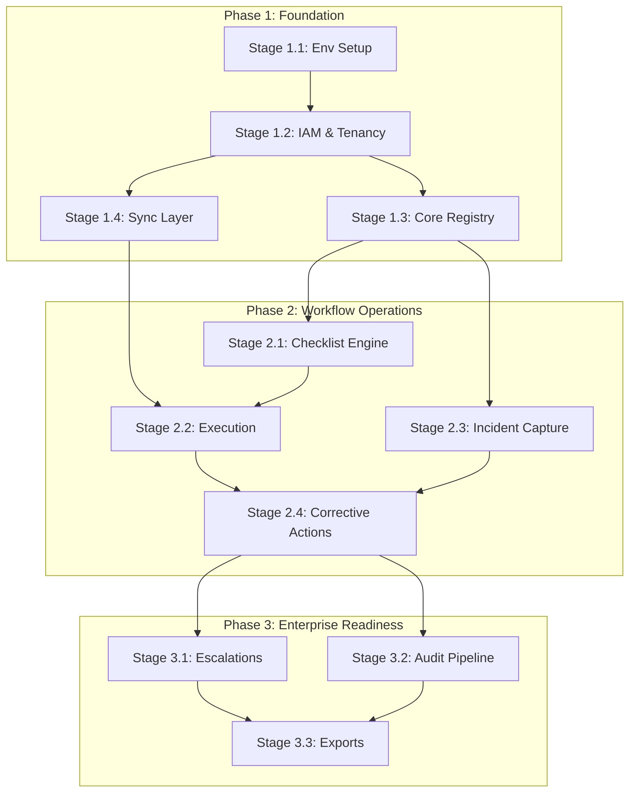

# OpsLens Implementation Task Graph

## Phase & Stage Graph

## Phase 1: Foundation

### Stage 1.1: Environment Setup [COMPLETED]
Tech: Expo 56, React Native.
Tech: Express 5.2, MySQL 8.4.
Req: [x] Init Expo bare workflow.
Req: [x] Init Express API server.
Req: [x] Configure Prisma database schemas.
Pass: [x] Mobile app builds locally.
Pass: [x] API returns 200 status.
Pass: [x] DB migrations run completely.

### Stage 1.2: IAM & Tenancy [COMPLETED]
Tech: JWT, Prisma RLS middleware.
Req: [x] Implement login auth endpoints.
Req: [x] Build tenant extraction middleware.
Req: [x] Setup role access controls.
Pass: [x] System blocks cross-tenant requests.
Pass: [x] Auth flow issues JWTs.

### Stage 1.3: Core Registry [COMPLETED]
Tech: MySQL schema, React Native.
Req: [x] Build CRUD REST endpoints.
Req: [x] Implement QR code scanner.
Req: [x] Build asset resolution API.
Pass: [x] Scanner loads localized asset.
Pass: [x] Assets resolve via API.

### Stage 1.4: Base Sync Layer
Tech: expo-sqlite, expo-file-system APIs.
Req: Setup local SQLite schema.
Req: Implement offline mutation queue.
Req: Write idempotent reconciliation endpoints.
Pass: App operates without network.
Pass: Queues flush upon reconnection.

## Phase 2: Workflow Operations

### Stage 2.1: Checklist Engine
Tech: JSON Schema, Prisma relations.
Req: Define dynamic question types.
Req: Build form template APIs.
Req: Implement dynamic React renderer.
Pass: Checklists render strictly defined.
Pass: Validations trigger exactly accurately.

### Stage 2.2: Inspection Execution
Tech: SQLite offline form caching.
Req: Cache assigned checklists locally.
Req: Auto-save draft responses locally.
Req: Sync responses on reconnect.
Pass: UI thread never blocks.
Pass: Responses sync completely reliably.

### Stage 2.3: Incident Capture
Tech: expo-image-picker, S3 URLs.
Req: Build incident reporting screens.
Req: Capture severity and photos.
Req: Implement background upload workers.
Pass: Media uploads succeed perfectly.
Pass: Failed uploads retry automatically.

### Stage 2.4: Corrective Actions
Tech: Status machines, API routing.
Req: Auto-generate action item tasks.
Req: Route incidents by severity.
Req: Track item lifecycle status.
Pass: Status transitions record safely.
Pass: Users view assignments instantly.

## Phase 3: Enterprise Readiness

### Stage 3.1: Escalation Engine
Tech: Redis cache, BullMQ workers.
Req: Configure Redis connection pool.
Req: Write SLA tracking processors.
Req: Implement push notification workers.
Pass: Overdue tasks trigger alerts.
Pass: Queue handles massive load.

### Stage 3.2: Audit Pipeline
Tech: Prisma extensions, Event sourcing.
Req: Intercept all DB mutations.
Req: Log actor and states.
Req: Store immutable append-only records.
Pass: DB changes generate logs.
Pass: Logs include diff states.

### Stage 3.3: Analytics & Exports
Tech: SQL aggregations, PDF generation.
Req: Build compliance summary APIs.
Req: Create PDF evidence generators.
Req: Render mobile dashboard charts.
Pass: System generates valid PDFs.
Pass: Queries execute under 100ms.
